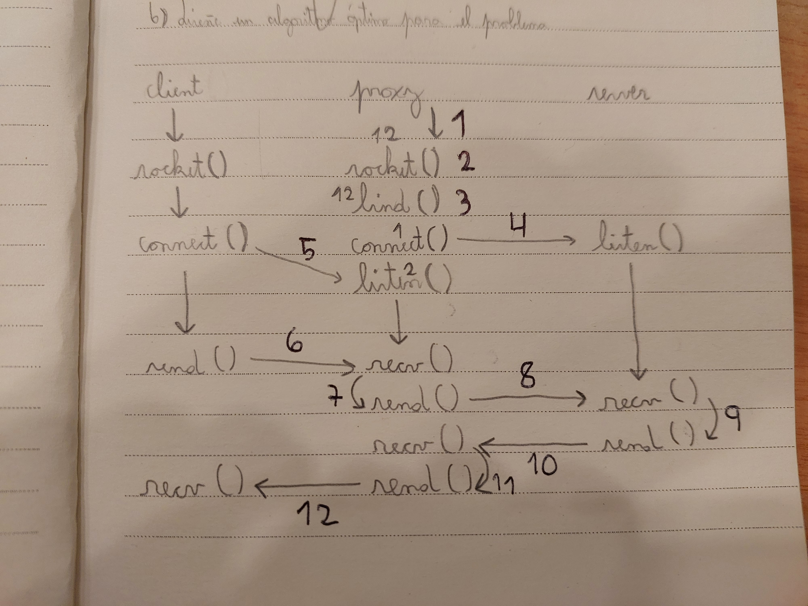
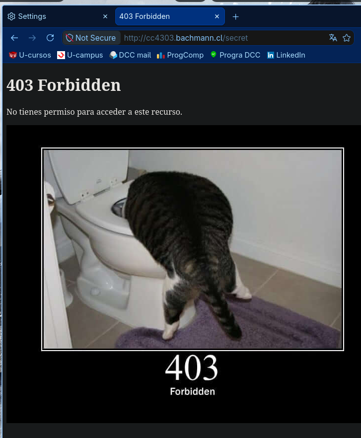
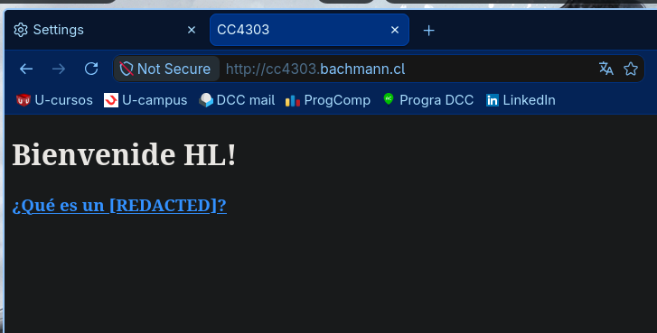
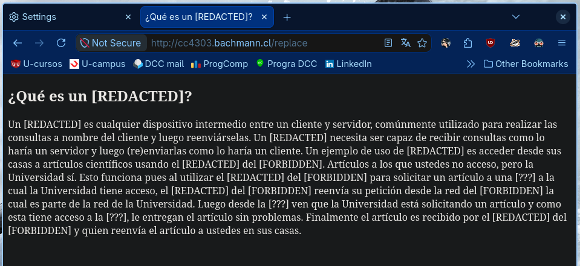

# Actividad: construir un proxy — CC4303 Redes

**Integrantes:** Hector Bonilla V, Lázaro Narváez U

---

## 1. Declaración de uso de IA

| Modelo | Integrante | Dónde se usó |
| --- | --- | --- |
| Gemini | Lázaro | Consultas puntuales de Python: `.items()`, `str.replace()`, sintaxis de diccionarios. Solo aprendizaje del lenguaje, no diseño. |
| Claude (Opus 5) | Lázaro | Código: diagnóstico de bugs en `recive_message`, cambio del body de `strings` a `bytes`. Pruebas: ejecución del proxy contra el servidor del curso. Redacción: estructura de este informe. |
| Claude (Sonnet) | Héctor | Consulta sobre el significado de `b""` en sockets, a raíz de un error durante el desarrollo. Revisión de código. |

---

## 2. Cómo ejecutar

```bash
python tcp_socket_server.py
```

- Requiere estar parado en la carpeta del repo (`rules.json` y `403.jpg` se leen con ruta relativa).
- El proxy escucha en el puerto 8000. La IP se cambia en la variable `IP_VM` de `tcp_socket_server.py`.
- Reglas configurables en `rules.json`: usuario, dominios bloqueados y palabras prohibidas.

Prueba rápida:

```bash
curl http://cc4303.bachmann.cl/ -x IP_VM:8000
```

**Entorno:** probado en máquina virtual (IP_VM) y en localhost (127.0.0.1).

---

## 3. Diagrama del proxy



**Sockets necesarios: 3.**

| Socket | Rol |
| --- | --- |
| `server_socket` | Portero. Solo hace `accept()`, no transfiere datos. |
| `new_socket` | Proxy actuando como **servidor** frente al cliente. Uno por conexión. |
| `proxy_socket` | Proxy actuando como **cliente** frente al servidor real. |

Idea central: un proxy es servidor y cliente a la vez. Recibe con `accept()` y pide con `connect()`.

---

## 4. Diseño

### 4.1 `parse_HTTP_message` — qué extrae

Separa el mensaje en tres partes, en `\r\n\r\n`:

| Campo | Tipo | Contenido |
| --- | --- | --- |
| `start_line` | `str` | `GET http://host/ruta HTTP/1.1` — método, path y versión |
| `head` | `dict[str, str]` | un par por header |
| `body` | `bytes` | contenido crudo |

Decisiones:

- **Headers como `str`, body como `bytes`.** Los headers son ASCII por especificación; el body puede ser binario (JPEG, gzip). Decodificarlo asumiendo UTF-8 rompe con imágenes.
- **`partition(b":")`** en vez de `split`: corta en el primer `:` nomás. Un header como `Date: Thu, 27 Aug 2026 17:07:08 GMT` tiene más de uno.

`create_HTTP_message` es la inversa exacta: rearma `start_line + headers + \r\n + body` y devuelve `bytes`.

### 4.2 Bloqueo de dominios

- Se compara la lista `blocked` del JSON contra el path de la start line.
- Al usar el proxy, el cliente manda la **URL completa** en la start line (`GET http://host/ruta`), no solo la ruta. Por eso una entrada como `cc4303.bachmann.cl/secret` calza.
- Bloqueado → se responde `403 Forbidden` con un HTML que incluye ``.
- **`/403.jpg` se intercepta ANTES del chequeo de bloqueo.** Es un recurso local, no del servidor remoto; si se chequeara después, el proxy iría a buscarlo afuera y devolvería 404.

**¿Cuántos ciclos HTTP para mostrar una imagen en un navegador?**
[COMPLETAR: cuenta las líneas del log del proxy al cargar la página de 403 — cada `conexión ... cerrada` es un ciclo]

### 4.3 Reemplazo de palabras

- Se recorre `forbidden_words` (una **lista de diccionarios** de un par cada uno) y se aplica `bytes.replace()` por cada par.
- Los reemplazos son acumulativos: cada vuelta trabaja sobre el resultado de la anterior.
- Tras reemplazar se **recalcula `Content-Length`**: el body cambia de tamaño (`proxy` = 5 bytes, `[REDACTED]` = 10). Con el body en `bytes` es `len(body)` directo — importa que sea el largo en bytes y no en caracteres, porque las páginas tienen tildes.

### 4.4 Modificación de headers

Se agrega `X-ElQuePregunta` con el nombre (tomado de `rules.json`) a la request que va del proxy al servidor.

### 4.5 Mensajes más grandes que el buffer

`recive_message` lee en dos fases:

**¿Cómo sé que el HEAD llegó completo?**
Por el delimitador `\r\n\r\n`. Se acumula en un buffer hasta encontrarlo.

**¿Qué pasa si los headers no caben en mi buffer?**
Nada: no se lee "un buffer", se acumula en un `while` hasta ver el delimitador. Funciona incluso con `buff_size=1`.

**¿Y el BODY?**
Por `Content-Length`. Se lee hasta que `len(body)` alcance ese valor.

**¿Cómo sé si llegó el mensaje completo?**
Dos criterios combinados: delimitador para el head, `Content-Length` para el body.

Detalle clave: un mismo `recv` puede traer el final del head **y** el inicio del body. Ese sobrante se conserva y se cuenta en `len(body)`; descartarlo hace que el proxy pida bytes de más y se cuelgue.

---

## 5. Pruebas

### 5.1 Con curl

| Prueba | Comando | Resultado |
| --- | --- | --- |
| Bloqueo | `curl http://cc4303.bachmann.cl/secret -x IP_VM:8000` | `403` |
| Imagen | `curl http://cc4303.bachmann.cl/403.jpg -x IP_VM:8000` | `200`, `image/jpeg`, 20134 bytes |
| Header | `curl http://cc4303.bachmann.cl/ -x IP_VM:8000` | `<h1>Bienvenide HL!</h1>` (valor tomado de `rules.json`) |
| Reemplazo | `curl http://cc4303.bachmann.cl/replace -x IP_VM:8000` | 9 `[REDACTED]`, 5 `[FORBIDDEN]`, 3 `[???]`; ninguna palabra sin censurar |
| Content-Length | `curl -i .../replace -x IP_VM:8000` | header 1225 = body 1225 bytes |

### 5.2 Tamaño de buffer

Head del servidor: 192 bytes. Start line: 17 bytes. Mensaje total: 1351 bytes.

| `buff_size` | Caso | Resultado |
| --- | --- | --- |
| 200 | menor que el mensaje, mayor que los headers | OK |
| 50 | menor que los headers, mayor que la start line | OK |
| 4 | menor que la start line | OK |
| 1 | mínimo posible | OK |

En los 4 casos el body llega completo y coincide con `Content-Length`.

### 5.3 Con el navegador

[COMPLETAR con capturas]

- `http://cc4303.bachmann.cl/secret`



- `http://cc4303.bachmann.cl/`



- `http://cc4303.bachmann.cl/replace`


